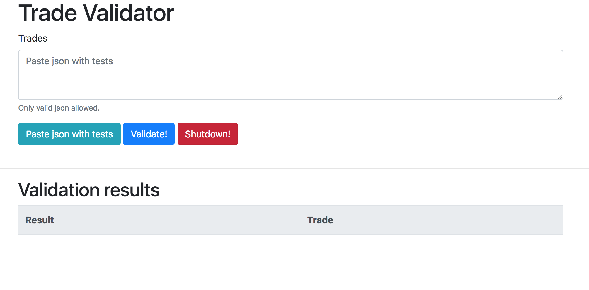

# [Trade validator project](https://github.com/LMskvtsv/TradeValidator)

## Technical description:
  Open project as maven project in IDE.
  
  Starting point of the application is the Application.class (src/main/java/ru package).
  
  After application is started go to http://localhost:8080/validator. You should see something like this:
  
  
  
  
  To paste test data, just press the "Paste json with tests" button.
  
  To validate data - press "Validate!" button.
  
  To shut down service  - press "Shut down" button.
  
  
## Task description:  
  We would like you to write a Java service (it should be delivered in the form of maven project) according to instructions given below. 
  Task was designed in a way that development should take one day. You’re given 3 days from the moment of receiving this description to prepare your solution and send it back to us. 
  Thus, we expect you to focus on high quality of code by using the best coding standards and principles you know, unit tests, javaDoc etc. 
  Application should be also easy to extend in the future. 
  
  Main activity part description: 
  The role of the service to validate the trade information – FX Spot, Forward, Options. In addition, there should be a small client provided Validation results shall be displayed in the GUI with the information about the failure. 
  
  **Technical requirements:**
  1. The service shall expose a REST interface consuming tests in JSON format and returning validation result to the client 
  2. Service shall be flexible to extend the validation logic in terms of: 
      - new business validation rules 
      - new products to be supported 
  3. Service should support graceful shutdown 
  
  **Business requirements:**
  
  1. The following basic validation rules shall be implemented: 
  
      ALL: 
      - value date cannot be before trade date 
      - value date cannot fall on weekend or non-working day for currency 
      - if the counterparty is one of the supported ones 
      - validate currencies if they are valid ISO codes (ISO 4217) 
      
      SPOT, FORWARD: 
      - validate the value date against the product type 
      
      OPTIONS specific: 
      - the style can be either American or European 
      - American option style will have in addition the excerciseStartDate, which has to be after the trade date but before the expiry date 
      - expiry date and premium date shall be before delivery date 
  
  1. The validation response should include information about errors detected in the trade (in case multiple are detected, all of them should be returned) and in case of bulk validation additional linkage between the error and the actual trade 
  
  Assumptions: 
  1. Current date is 18.07.2017 
  2. Supported counterparties (customers) are: PLUTO1, PLUTO2 
  3. Only one legal entity is used: CS Zurich 
  
  
   

  
  
  

